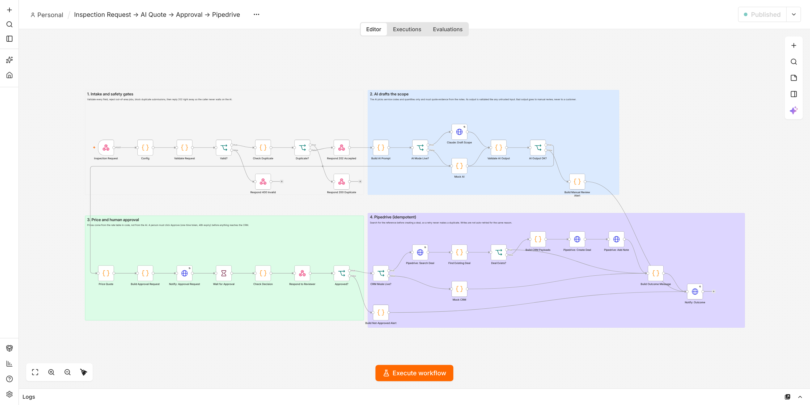

# Inspection Request → AI Quote → Approval → Pipedrive

An n8n workflow for a commercial hard-surface inspection and repair business. It takes an inspection request (from a web form, call notes or an inspector), has an AI draft the scope of work, prices it from a rate table, waits for a person to approve it, then creates the deal and quote note in Pipedrive.

It is built to **run unattended safely**: every AI output is validated before use, prices never come from the AI, nothing reaches the CRM without human approval, duplicates are blocked at two levels, and any failure alerts the team with a link to the failed execution.



## What happens to a request

1. **Intake.** A webhook receives the request. Every field is validated and cleaned (email, AU phone format, service area: Melbourne, Sydney or Brisbane, description length, https photo links). Invalid requests get a `400` listing every problem.
2. **Duplicate guard.** A repeat of the same request within 72 hours gets `200 duplicate` and stops. Otherwise the caller gets `202 accepted` with a reference like `INSP-7CDEC5` right away, so it never waits on the AI.
3. **AI drafts the scope.** Claude reads the notes and returns JSON: service codes from a fixed catalog, quantities, and the exact words from the notes that justify each line ("evidence").
4. **AI output is validated** like untrusted input. It is rejected and sent to manual review if it is not valid JSON, is cut off, uses a service code that does not exist, has impossible quantities, or quotes evidence that is not in the notes.
5. **Pricing in code.** Rates come from `src/config.js`, maths is done in whole cents, the minimum charge and 10% GST are applied, and high-value quotes are flagged.
6. **Human approval.** An approval request with Approve and Reject links is posted to the team. Links carry a one-time token and expire after 48 hours. A wrong token or an expired link fails closed: nothing is sent and the team is told.
7. **Pipedrive.** Searches for the reference first and only creates the deal and note if it does not already exist, so a retry never creates a duplicate deal.
8. **Outcome and errors.** Every path ends in a notification. Any node failure triggers the separate error workflow.

## Safety measures

| Risk | What the workflow does |
|---|---|
| Bad or malicious input | Validates and cleans every field; rejects with a clear `400` |
| Double-submitted form / webhook retry | Dedup key in workflow static data (72h), plus a Pipedrive search before every create |
| AI invents work or services | Codes must exist in the catalog; each line must quote evidence found word for word in the notes |
| AI gets quantities wrong | Positive-number checks, whole numbers for "each" items, per-service sanity caps, and confidence/assumption warnings shown to the approver |
| AI or customer manipulates the price | The AI never sets prices; pricing is deterministic code. Instruction-like text in notes is flagged to the reviewer |
| Truncated or non-JSON AI response | Detected; quote goes to manual review |
| API outage | AI and read calls retry 3 times with backoff; on final failure the error workflow alerts with a link to the execution |
| Duplicate CRM writes on retry | Creating deals and notes is deliberately **not** auto-retried (not idempotent); a failure alerts instead |
| Guessable approval links | n8n's signed resume URL plus a random one-time token, compared in constant time |
| Quote forgotten | Approval window expires after 48h and the team is told |
| Secrets leaking to GitHub | Keys live only in n8n Credentials; a test fails if a key pattern appears in the exported JSON |

## Repository layout

```
src/            All the logic, as plain JavaScript functions (one file per step)
  config.js     Settings, service catalog and rates: the file you edit most
test/           Unit tests for src/ and structural checks on the built workflows
build/          Script that copies src/ into the n8n Code nodes
workflows/      Importable n8n workflows (generated: do not edit by hand)
samples/        Example requests, including ones that exercise each safety check
scripts/        send-sample.js (send a test request), mock-apis.js (fake Anthropic + Pipedrive)
docs/           Test log and screenshots
CLAUDE.md       Instructions for making changes with Claude Code
```

The JavaScript lives in `src/`, not only inside n8n, so it can be reviewed, tested and versioned. `npm run build` copies it into the Code nodes.

## Run it locally (no API keys needed)

Needs Docker Desktop. Node.js 20+ is only needed for the test scripts.

1. Start n8n:
   ```
   docker volume create n8n_data
   docker run -d --name n8n -p 5678:5678 -e GENERIC_TIMEZONE=Australia/Melbourne -v n8n_data:/home/node/.n8n --restart unless-stopped docker.n8n.io/n8nio/n8n
   ```
2. Open http://localhost:5678 and import the three files in `workflows/` (Workflows → ⋯ → Import from File). Import `inspection-quote-error-alerts.json` first.
3. Open the main workflow → **Settings** → **Error Workflow** → choose *Inspection Quote: Error Alerts*. (Imported IDs can change, so check this.)
4. **Publish** (activate) all three workflows. If n8n asks for the Anthropic or Pipedrive credentials, create them now with any placeholder value; mock mode never calls them.
5. Send a test request:
   ```
   node scripts/send-sample.js
   ```
   or in PowerShell:
   ```
   Invoke-RestMethod -Method Post -Uri http://localhost:5678/webhook/inspection-request -ContentType 'application/json' -InFile samples/good-request.json
   ```
6. Open http://localhost:5678/webhook/inbox and click **Approve** or **Reject**. Refresh to see the outcome.

Try the other samples to see each safety check:

| Sample | Expected result |
|---|---|
| `good-request` | 202, approval request, then deal created on approve |
| (send `good-request` again) | 200 duplicate |
| `invalid-request` | 400 with every problem listed |
| `ai-invents-work-request` | Manual review alert: unknown service code |
| `no-measurements-request` | Approval request with low-confidence and assumption warnings |
| `prompt-injection-request` | Approval request flagged as possible prompt injection; price still from rate table |

Note: duplicate blocking uses workflow static data, which n8n only saves for published (production) executions, not manual test runs.

## Going live

1. In n8n, create credentials:
   - **Anthropic API Key**: type *Header Auth*, name `x-api-key`, value your key.
   - **Pipedrive API Token**: type *Query Auth*, name `api_token`, value your token.
   Then select them in the *Claude: Draft Scope* and three *Pipedrive* nodes.
2. In `src/config.js` set `aiMode: 'live'`, `crmMode: 'live'`, your Pipedrive `crm.baseUrl`, the real rates in `catalog`, and `notify` to a Slack, Discord or Google Chat incoming-webhook URL with the matching `channel`.
3. `npm run check` (rebuild + tests), then re-import `workflows/inspection-quote-main.json`.

To test the live HTTP paths without real accounts, run `node scripts/mock-apis.js` and point `ai.url` and `crm.baseUrl` at `http://host.docker.internal:4010/...` (see the comments in that file). It can also simulate outages to test retries and error alerts.

## Testing

```
npm test
```

34 tests cover validation, dedup, AI-output checks (bad JSON, invented codes, ungrounded evidence, quantity caps, truncation), pricing and rounding, approval tokens, CRM dedup and HTML escaping, plus checks that the built workflows are current, every Code node compiles, every branch is wired, and no secrets are in the export.

The full workflow was also run end to end in n8n 2.42, in mock and live mode against the mock APIs. See [docs/TEST-LOG.md](docs/TEST-LOG.md).

## Limitations

- Rates in `config.js` are placeholders.
- The mock AI is keyword-based and only exists for demos and tests. For example, it does not read "two tiles" as 2, so it adds an assumption warning (which also shows the warning system working).
- Static-data dedup suits a single n8n instance. For queue mode with several workers, move it to a database table with a unique key.
- The customer-facing quote PDF/email is out of scope; the approved quote is stored as a Pipedrive note.
